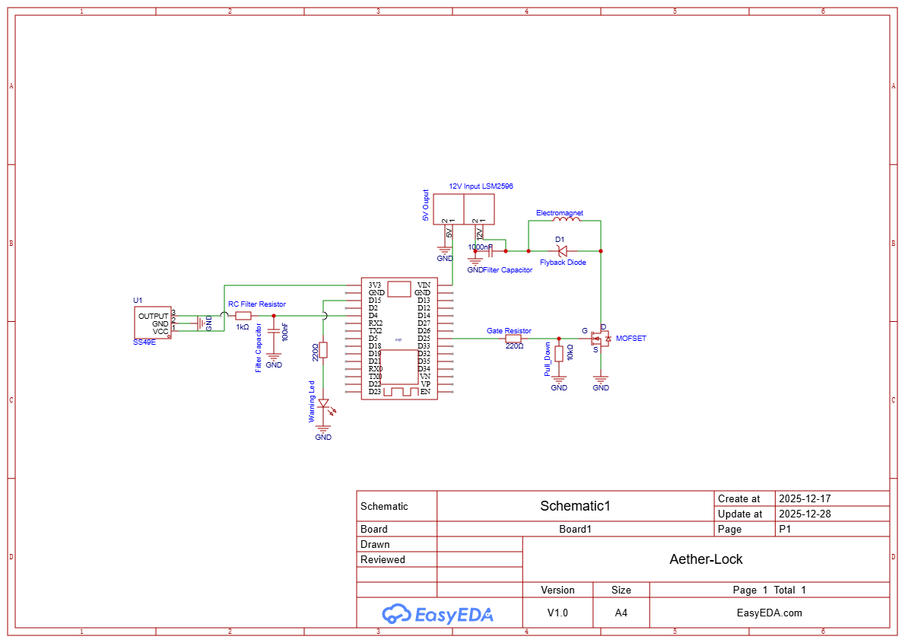

# Hardware Design & Assembly

This document details the physical implementation of the **Aether-Lock** system, including the circuit design, component selection, and signal conditioning.

## 🔌 Circuit Schematic
The circuit is divided into three stages: Power (12V), Logic (5V/3.3V), and Sensing.

*   **[Download Schematic PDF](../../Hardware/Schematics/Aether_Lock_Schematic_v1.pdf)**

---

## 📦 Bill of Materials (BOM)

### Core Components
| Component | Specification | Function |
| :--- | :--- | :--- |
| **MCU** | ESP32 DevKit V1 (WROOM) | 240MHz Dual Core Controller. Handles PID loop and Safety FSM. |
| **Actuator** | 12V Solenoid (P25/20) | Generates the magnetic field. High inductance stabilizes current. |
| **Driver** | IRLZ44N MOSFET | Logic-Level (3.3V gate) switch. Low $R_{DS(on)}$ minimizes heat. |
| **Sensor** | SS49E Hall Effect | Linear ratiometric sensor. $V_{out} \propto B_{field}$. |

### Power & Safety
| Component | Specification | Function |
| :--- | :--- | :--- |
| **Buck Converter** | LM2596 | Efficiently steps down 12V $\to$ 5V for the ESP32. |
| **Flyback Diode** | 1N4007 | Protects the MOSFET from voltage spikes when PWM turns off. |
| **Bulk Capacitor** | 1000µF 25V | Stabilizes the 12V rail against PWM-induced voltage sags. |
| **Warning LED** | Red LED + 330 $\Omega$ | Visual indicator for thermal warning or error state. |

---

## 🔬 Signal Conditioning

To ensure a stable PID derivative term, the noisy Hall sensor signal is conditioned both in hardware and software.

### Hardware Filter (Anti-Aliasing)
An RC Low-Pass filter is placed physically close to the ESP32 pins to kill high-frequency noise from the PWM (20kHz).

*   **Resistor ($R$):** $1 k\Omega$ (Series)
*   **Capacitor ($C$):** $100 nF$ (Shunt to GND)
*   **Cut-off Frequency:** $f_c = \frac{1}{2\pi RC} \approx 1.6 \text{ kHz}$ (Well below the Nyquist limit of the 5kHz loop).

### Software Compensation
The firmware applies:
1.  **Oversampling:** Moving Average Filter (Window size defined in `project_config.json`).
2.  **Feedforward:** Subtraction of the coil's self-generated magnetic field (Coupling Factor identified in `Measurements`).

---

## 🛠️ Assembly Notes
1.  **Star Ground:** Connect all GND points (12V Supply, ESP32, MOSFET Source) to a single point on the breadboard to avoid ground loops.
2.  **Heatsink:** The Solenoid can get warm. Ensure it is not fully enclosed in thermal insulators (like cotton/styrofoam) without airflow.
3.  **Sensor Placement:** The SS49E must be glued exactly at the center of the coil face, with the branded side facing the magnet.