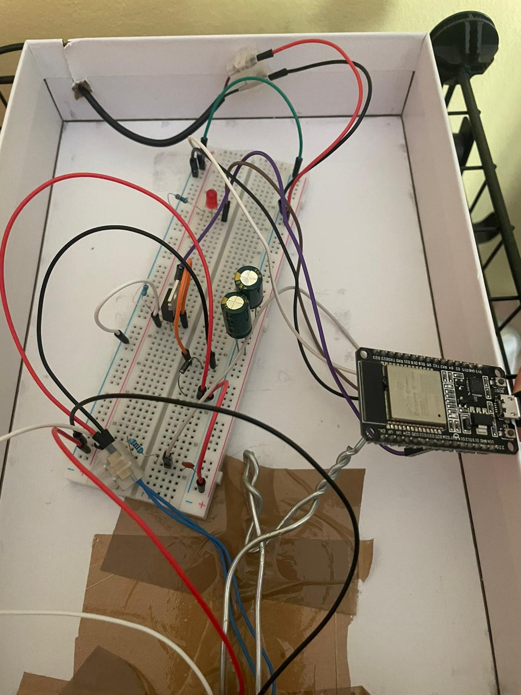
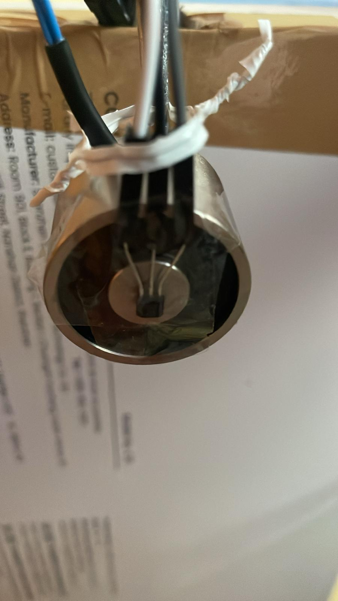

# Hardware Design & Assembly

This document details the physical implementation of the **Aether-Lock** system, including the circuit design, component selection, and signal conditioning.

## 🔌 Circuit Schematic
The circuit is divided into three stages: Power (12V), Logic (5V/3.3V), and Sensing.

*   **[Download Schematic PDF](../../Hardware/Schematics/Aether_Lock_Schematic_v1.pdf)**

---
## 📦 Bill of Materials (BOM)

The system relies on critical components such as the **ESP32-WROOM**, **IRLZ44N MOSFET**, and **SS49E Linear Hall Sensor**.

> **Shopping List:** The detailed list of all required parts, along with sourcing links and specifications, is maintained in a dedicated file to ensure version control.
>
> 📄 **[Open BOM.md](./BOM.md)**
---

## 🔬 Signal Conditioning

To ensure a stable PID derivative term, the noisy Hall sensor signal is conditioned both in hardware and software.

### Hardware Filter (Anti-Aliasing)
An RC Low-Pass filter is placed physically close to the ESP32 pins to kill high-frequency noise from the PWM (20kHz).

*   **Resistor ($R$):** $1 k\Omega$ (Series)
*   **Capacitor ($C$):** $100 nF$ (Shunt to GND)
*   **Cut-off Frequency:** $f_c = \frac{1}{2\pi RC} \approx 1.6 \text{ kHz}$ (Well below the Nyquist limit of the 5kHz loop).

### Software Compensation
The firmware applies:
1.  **Oversampling:** Moving Average Filter (Window size defined in `project_config.json`).
2.  **Feedforward:** Subtraction of the coil's self-generated magnetic field (Coupling Factor identified in `Measurements`).

---

## 🛠️ Assembly Notes
1.  **Star Ground:** Connect all GND points (12V Supply, ESP32, MOSFET Source) to a single point on the breadboard to avoid ground loops.
2.  **Heatsink:** The Solenoid can get warm. Ensure it is not fully enclosed in thermal insulators (like cotton/styrofoam) without airflow.
3.  **Sensor Placement:** The SS49E must be glued exactly at the center of the coil face, with the branded side facing the magnet.

