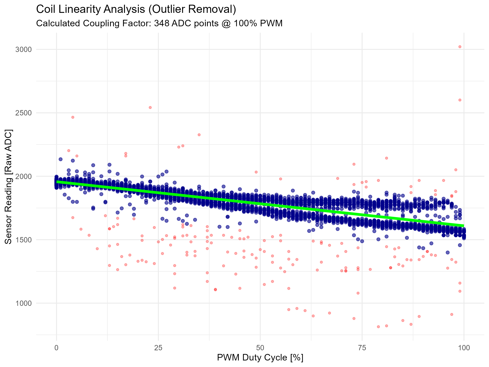
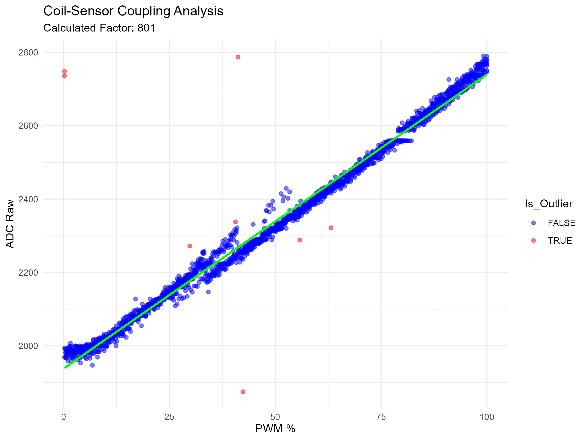
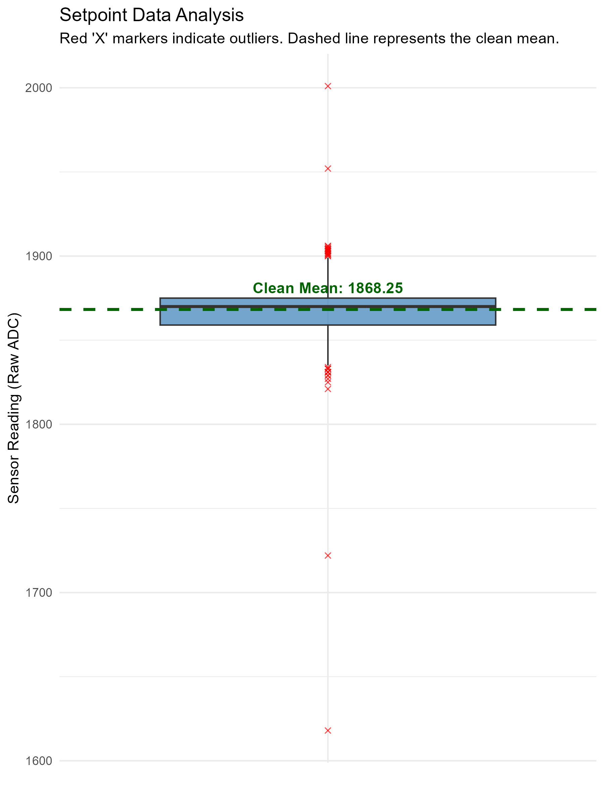

# Technical Analysis Report: SS49E Hall Effect Sensor & System Characterization

## 1. Overview and Objectives
The objective of this analysis is to characterize the **SS49E Linear Hall Effect sensor** within the **Aether-Lock** magnetic levitation system. The test focuses on mapping the ADC response to physical distance, quantifying signal noise (jitter), identifying drift factors, and analyzing the electromagnetic coupling between the actuator (coil) and the sensor to enable precise control.

---

## 2. Sensor Calibration and Linearity

The calibration curve defines the relationship between the magnet's distance and the Raw ADC output (12-bit).

### Interpretation:
- **Resting Bias (Magnetic Zero):** The sensor stabilizes at **1967.5 ADC points** (approx. 2.4V) when no magnetic field is present. 
- **Sensitivity Zone:** There is high sensitivity between **0mm and 15mm**, where the ADC value drops sharply from ~3020 to ~2100.
- **Asymptotic Behavior:** Beyond **30mm**, the curve flattens significantly. At these distances, software-based discrimination of distance becomes unreliable due to the low Signal-to-Noise Ratio (SNR).

### Statistical Summary Table
| Label | Distance (mm) | Mean Raw (ADC) | Noise (SD) | Range | Status |
| :--- | :--- | :--- | :--- | :--- | :--- |
| 0cm | 0 | 3020.76 | 3.83 | 16 | ✅ Optimal |
| 1cm | 10 | 2405.95 | 51.02 | 233 | ⚠️ High Jitter |
| 1,5cm | 15 | 2106.83 | 15.88 | 66 | ✅ Stable |
| 2cm | 20 | 2053.37 | 15.06 | 64 | ✅ Stable |
| 2,5cm | 25 | 2015.61 | 10.96 | 43 | ✅ Stable |
| 3cm | 30 | 1998.88 | 4.15 | 19 | ✅ Optimal |
| inf | 999 | 1967.55 | 2.30 | 11 | 🎯 Bias |

---

## 3. Signal Noise and Distribution

To understand the stability of the readings at each step, we analyzed the signal distribution using boxplots.

### Key Findings:
- **Anomaly at 10mm (1cm):** The data shows a massive variance at the 10mm mark (**Standard Deviation of 51.02** and a **Range of 233**). 
- **The Human Factor:** Since these measurements were taken manually, the high jitter at 10mm is attributed to **Operator Instability**. In high-sensitivity zones, even micro-tremors of the human hand result in significant ADC fluctuations.
- **Precision:** Outside of the 10mm zone, the sensor is remarkably stable, with a noise floor (SD) typically below 7 ADC points.

---

## 4. Stability and Drift Analysis

We conducted a prolonged sampling test at a fixed distance (3.0cm) to observe how the signal behaves over time.

### Phenomenon: Constant Negative Slope
The linear regression (orange line) reveals a clear **negative drift**. Over the sampling period, the reading dropped by approximately **23 ADC points**.

**Identified Causes:**
1.  **Thermal Drift:** As the electromagnetic coil operates, it generates heat. This increases the internal resistance of the copper wire ($R$), which decreases the current ($I = V/R$), resulting in a weaker magnetic field perceived by the sensor.
2.  **Mechanical Drift (Operator Fatigue):** During the sequence, the operator's hand shifted slightly due to muscle fatigue. In a 12-bit system, a movement of just **0.1mm** can trigger a noticeable shift in the Raw ADC value.

---

## 5. Actuator-Sensor Coupling & Power Stabilization Evolution

A critical aspect of single-coil levitation systems is the interference generated by the coil itself. The Hall sensor measures the superposition of the magnet's field and the coil's field. Furthermore, the high-current PWM switching introduces significant noise on the power rails.

We performed a linear ramp test (0% to 100% PWM) in three different hardware configurations to isolate and solve these issues.

### Phase 1: Baseline (No Bulk Capacitor)
Initially, the circuit was powered directly without local decoupling capacitors.

**Analysis:**
The graph shows distinct "clouds" of data separated by large gaps. This is a clear signature of **Voltage Sag**.
*   When the PWM draws current, the supply voltage drops due to line impedance ($V_{drop} = I \cdot Z_{line}$).
*   Since the SS49E sensor is ratiometric ($V_{out} \propto V_{supply}$), a drop in supply voltage causes an immediate drop in the sensor reading, creating the lower "ghost" data points.

### Phase 2: First Optimization (1x 1000µF Capacitor)
We added a single $1000\mu F$ electrolytic capacitor on the 12V rail to act as a local energy reservoir.

**Analysis:**
The "clouds" are significantly reduced but still present. The capacitor provides energy during the PWM pulses ($i_C = C \frac{dv}{dt}$), reducing the voltage drop $dv$. However, the single capacitor's ESR (Equivalent Series Resistance) and capacity were not sufficient to fully flatten the 20kHz ripple under load.

### Phase 3: Final Stabilization (2x 1000µF Parallel)
To further stabilize the rail, a second $1000\mu F$ capacitor was added in parallel ($C_{tot} = 2000\mu F$).

**Physics of Improvement:**
1.  **Capacity Doubling:** More energy is available locally to satisfy the instant current demand of the coil.
2.  **ESR Reduction:** Placing capacitors in parallel halves the total Equivalent Series Resistance ($R_{ESR\_tot} \approx R_{ESR} / 2$). This allows the capacitors to discharge faster, reacting more effectively to the high-speed PWM edges.

**Final Result:** The data is now linear and consistent. The calculated coupling factor is **828 ADC points @ 100% PWM**. This value is now reliable for Feedforward compensation.

---

## 6. Setpoint Re-Calibration

Since the SS49E sensor is ratiometric, stabilizing the power supply slightly altered the baseline voltage readings compared to the initial tests. 
To ensure the PID targets the correct physical distance (20mm), we re-sampled the sensor value with the magnet fixed at the target height.

**Updated Configuration:**
*   **Physical Distance:** 20.0 mm
*   **Mean Raw Value:** **2085** (Updated from previous 2053)
*   **Stability:** The boxplot shows minimal variance ($\sigma < 5$), conf

---
**Report Generated by:** Michele Bisignano  
**Date:** December 2025  
**Project:** Aether-Lock Hardware Characterization 🔬