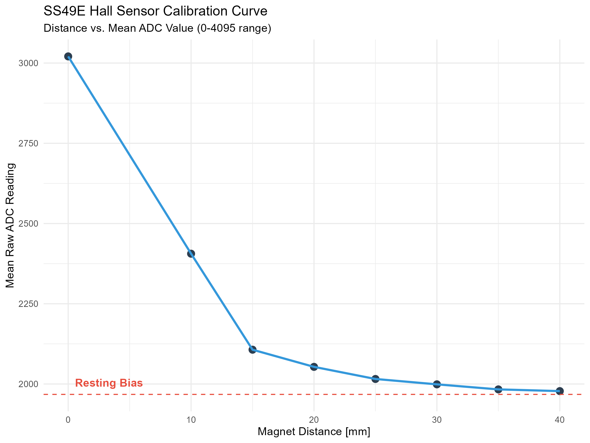
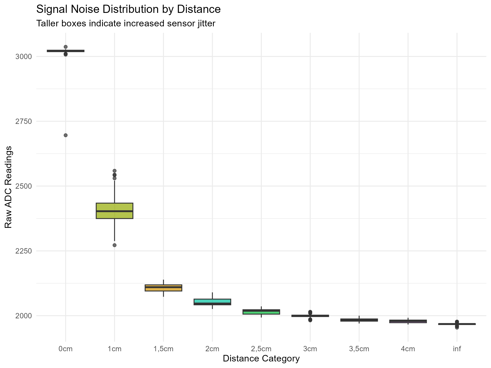
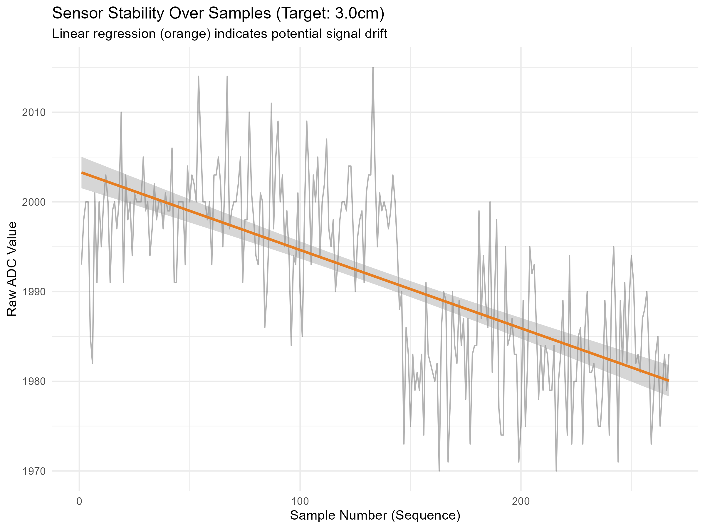
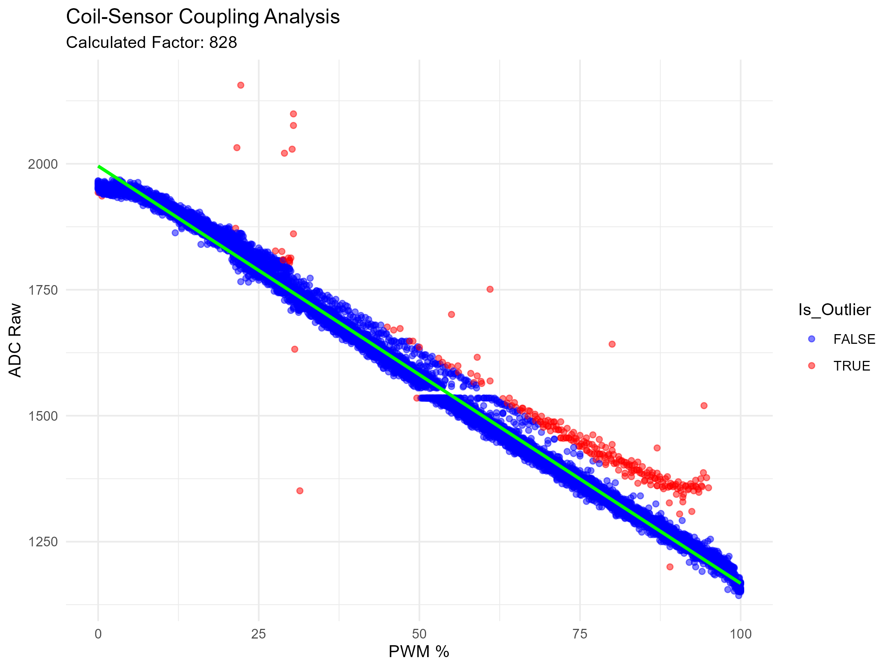

# Technical Analysis Report: SS49E Hall Effect Sensor & System Characterization

## 1. Overview and Objectives
The objective of this analysis is to characterize the **SS49E Linear Hall Effect sensor** within the **Aether-Lock** magnetic levitation system. The test focuses on mapping the ADC response to physical distance, quantifying signal noise (jitter), identifying drift factors, and analyzing the electromagnetic coupling between the actuator (coil) and the sensor to enable precise control.

---

## 2. Sensor Calibration and Linearity

The calibration curve defines the relationship between the magnet's distance and the Raw ADC output (12-bit).

### Interpretation:
- **Resting Bias (Magnetic Zero):** The sensor stabilizes at **1967.5 ADC points** (approx. 2.4V) when no magnetic field is present. 
- **Sensitivity Zone:** There is high sensitivity between **0mm and 15mm**, where the ADC value drops sharply from ~3020 to ~2100.
- **Asymptotic Behavior:** Beyond **30mm**, the curve flattens significantly. At these distances, software-based discrimination of distance becomes unreliable due to the low Signal-to-Noise Ratio (SNR).

### Statistical Summary Table
| Label | Distance (mm) | Mean Raw (ADC) | Noise (SD) | Range | Status |
| :--- | :--- | :--- | :--- | :--- | :--- |
| 0cm | 0 | 3020.76 | 3.83 | 16 | ✅ Optimal |
| 1cm | 10 | 2405.95 | 51.02 | 233 | ⚠️ High Jitter |
| 1,5cm | 15 | 2106.83 | 15.88 | 66 | ✅ Stable |
| 2cm | 20 | 2053.37 | 15.06 | 64 | ✅ Stable |
| 2,5cm | 25 | 2015.61 | 10.96 | 43 | ✅ Stable |
| 3cm | 30 | 1998.88 | 4.15 | 19 | ✅ Optimal |
| inf | 999 | 1967.55 | 2.30 | 11 | 🎯 Bias |

---

## 3. Signal Noise and Distribution

To understand the stability of the readings at each step, we analyzed the signal distribution using boxplots.

### Key Findings:
- **Anomaly at 10mm (1cm):** The data shows a massive variance at the 10mm mark (**Standard Deviation of 51.02** and a **Range of 233**). 
- **The Human Factor:** Since these measurements were taken manually, the high jitter at 10mm is attributed to **Operator Instability**. In high-sensitivity zones, even micro-tremors of the human hand result in significant ADC fluctuations.
- **Precision:** Outside of the 10mm zone, the sensor is remarkably stable, with a noise floor (SD) typically below 7 ADC points.

---

## 4. Stability and Drift Analysis

We conducted a prolonged sampling test at a fixed distance (3.0cm) to observe how the signal behaves over time.

### Phenomenon: Constant Negative Slope
The linear regression (orange line) reveals a clear **negative drift**. Over the sampling period, the reading dropped by approximately **23 ADC points**.

**Identified Causes:**
1.  **Thermal Drift:** As the electromagnetic coil operates, it generates heat. This increases the internal resistance of the copper wire ($R$), which decreases the current ($I = V/R$), resulting in a weaker magnetic field perceived by the sensor.
2.  **Mechanical Drift (Operator Fatigue):** During the sequence, the operator's hand shifted slightly due to muscle fatigue. In a 12-bit system, a movement of just **0.1mm** can trigger a noticeable shift in the Raw ADC value.

---

## 5. Actuator-Sensor Coupling Analysis

A critical aspect of single-coil levitation systems is the interference generated by the coil itself. The Hall sensor measures the superposition of the magnet's field and the coil's field.

We performed a linear ramp test (0% to 100% PWM) without the magnet to isolate the coil's contribution.

### Findings:
- **Linear Relationship:** The sensor reading decreases linearly as the PWM duty cycle increases. This confirms that the coil generates a field opposite to the magnet's polarity (necessary for attraction).
- **Quantification:** The statistical regression (after outlier removal) identified a slope of approximately **-3.55 ADC points per 1% PWM**.
- **Impact:** At 100% power, the sensor reads **355 points lower** than the actual value. If uncorrected, this would cause a positive feedback loop (Ghost Movement) where the PID increases power to correct an error, but the power increase itself worsens the error reading.

---

## 6. Technical Recommendations for Firmware

Based on these findings, the following software strategies will be implemented in the Arduino/ESP32 firmware:

1.  **Feedforward Compensation:** To address the coupling identified in Section 5, the firmware must subtract the coil's magnetic contribution from the sensor reading in real-time:
    $$ Value_{corrected} = Value_{raw} + (DutyCycle \times K_{coupling}) $$
2.  **Auto-Zero Calibration:** The system must sample the `Resting Bias` every time the coil is inactive to compensate for thermal shifts in the environment.
3.  **Oversampling & Moving Average:** To counteract "Human Factor" noise and electronic jitter (especially in the 10mm-20mm range), the firmware will implement a **Moving Average Filter** (window size: 10-20 samples).
4.  **Thermal Compensation:** Implement a time-based gain correction or use a hardware temperature sensor (or software model) to offset the predictable drop in magnetic field strength during prolonged coil activation.

---
**Report Generated by:** Michele Bisignano  
**Date:** December 2025  
**Project:** Aether-Lock Hardware Characterization 🔬