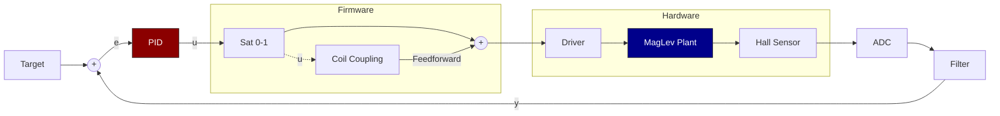

# Mathematical Model & Control Design

**Project:** Aether-Lock  
**Type:** Active Magnetic Levitation System (SISO)  
**Method:** Model-Based Design

---

## 1. Physical System Modeling
The system controls the vertical position $x$ of a ferromagnetic object (mass $m$) via electromagnetic attraction, countering gravity $g$.
**Newton's Second Law:**

$$ m \ddot{x}(t) = F_{gravity} - F_{magnetic}(x, i) $$
$$ m \ddot{x}(t) = m g - F_m(x, i) $$

---

## 2. Magnetic Force Modeling
The force on a permanent magnet (dipole moment $\mathbf{m}$) is the gradient of the magnetic field $\mathbf{B}$:
$$ \mathbf{F} = \nabla (\mathbf{m} \cdot \mathbf{B}) \implies F_x = m_{mag} \cdot \frac{dB_x}{dx} $$

### 2.1 Parameter Identification
**Magnetic Dipole Moment ($m_{mag}$):**
Derived analytically from Remanence ($B_r$) and Volume ($V$), referenced from [2].

$$ m_{mag} = \frac{B_r \cdot V}{\mu_0} \approx \mathbf{0.1511} \, A \cdot m^2 $$

**Core Amplification ($\mu_{eff}$):**
The ferromagnetic core amplifies the field compared to air. $\mu_{eff}$ is estimated by comparing theoretical air-core field ($B_{air}$) with the datasheets' holding force ($F_{hold} \approx 80N \to B_{real} \approx 1.3T$).

$$ \mu_{eff} = \frac{B_{real}}{B_{air}} \approx 50 $$

### 2.2 Ground Truth Model (Thick Solenoid)
For accurate simulation, we use the **Biot-Savart law** for a finite thick solenoid (inner radius $R_1$, outer $R_2$, length $L$), amplified by $\mu_{eff}$ [1]:

$$ F_{magn} = -\mu_{eff} \cdot \frac{I\,N\,m_{\mathrm{mag}}\,\mu _{0}}{2\,L\,\left(R_{1}-R_{2}\right)} \left[\ln\left(\frac{R_{2}+\sqrt{{R_{2}}^2+{\left(\frac{L}{2}+z\right)}^2}}{R_{1}+\sqrt{{R_{1}}^2+{\left(\frac{L}{2}+z\right)}^2}}\right)-\ln\left(\frac{R_{2}+\sqrt{{\left(\frac{L}{2}-z\right)}^2+{R_{2}}^2}}{R_{1}+\sqrt{{\left(\frac{L}{2}-z\right)}^2+{R_{1}}^2}}\right) + \dots \right] $$

*(Full derivative implementation available in `identify_physics.m`)*.

### 2.3 Simplified Control Model
For real-time control, the complex model is approximated by a local Power Law fitted to the ground truth:

$$ F_m(x, i) \approx K_{mag} \frac{i(t)}{x(t)^n} $$

*   **Linearity ($i$):** Valid for permanent dipole interaction.
*   **Exponent ($n$):** Captures effective field decay (geometry compensation).

---

## 3. Equilibrium & Linearization
Substituting the simplified model into dynamics:
$$ m \ddot{x} = m g - K_{mag} \frac{i}{x^n} $$

### 3.1 Equilibrium
At operating point ($\ddot{x} = 0$, $x = \bar{x}$), the bias current $\bar{i}$ is:
$$ \bar{i} = \frac{m g \bar{x}^n}{K_{mag}} $$

### 3.2 Linearization (Small Signal)
Taylor expansion around $(\bar{x}, \bar{i})$ yields the linear ODE:
$$ m \ddot{\tilde{x}} = \left( n \frac{mg}{\bar{x}} \right) \tilde{x} - \left( \frac{mg}{\bar{i}} \right) \tilde{i} $$

Dividing by $m$:
$$ \ddot{\tilde{x}} = \left( \frac{n g}{\bar{x}} \right) \tilde{x} - \left( \frac{g}{\bar{i}} \right) \tilde{i} $$

### 3.3 Transfer Function
### 3.3 Transfer Function
Laplace transform ($G(s) = X(s)/I(s)$):

$$
s^2 X(s) - \frac{ng}{\bar{x}} X(s) = - \frac{g}{\bar{i}} I(s) \implies G(s) = \frac{- \frac{g}{\bar{i}}}{s^2 - \frac{ng}{\bar{x}}}
$$

**Stability:** Poles at $s = \pm \sqrt{\frac{ng}{\bar{x}}}$. One positive real pole $\to$ **Open-Loop Unstable**.

---

## 4. Control Architecture
**System Parameters:** [View Table](System_Parameters.md)

**Block Definitions:**
*   **Controller:** Discrete PID (Backward Euler). Inputs: $e[k]$. Output: Duty $u[k]$.
*   **Plant:** Linearized model $G(s)$. Gains derived from MATLAB identification ($k_x, k_i$).
*   **Feedforward:** Compensates for sensor-coil coupling: $y_{clean} = y_{raw} + (K_{coupling} \cdot u[k])$.

---

## 5. Controller Design (Pole Placement)
Gains are derived analytically to stabilize the plant by imposing target closed-loop dynamics.

### 5.1 Characteristic Equation
$$ 1 + C(s)G(s) = 0 \implies 1 + \left( \frac{K_d s^2 + K_p s + K_i}{s} \right) \left( \frac{-k_i}{m s^2 - k_x} \right) = 0 $$
$$ m s^3 + (k_i K_d) s^2 + (k_i K_p - k_x) s + (k_i K_i) = 0 $$

### 5.2 Target Dynamics
Target polynomial with bandwidth $\omega_c > \sqrt{k_x/m}$ and damping $\zeta \approx 0.707$:
$$ P_{target}(s) = (s + p_{real}) (s^2 + 2\zeta\omega_c s + \omega_c^2) $$

### 5.3 Analytical Gains
Equating coefficients yields the tuning formulas:

**Derivative ($K_d$):**
$$ K_d = \frac{m \cdot (2\zeta\omega_c + p_{real})}{k_i} $$

**Proportional ($K_p$):**
$$ K_p = \frac{m (\omega_c^2 + 2\zeta\omega_c p_{real}) + k_x}{k_i} $$

**Integral ($K_i$):**
$$ K_i = \frac{m \cdot \omega_c^2 \cdot p_{real}}{k_i} $$

## References
1.  Fuso, F. (2015). *Campo magnetico prodotto da un solenoide*. Dipartimento di Fisica, Università di Pisa. [Online PDF](https://osiris.df.unipi.it/~fuso/dida/solenoide.pdf)
2.  Supermagnete. *Physical magnet data*. Retrieved December 2025 from [supermagnete.de](https://www.supermagnete.de/eng/physical-magnet-data)